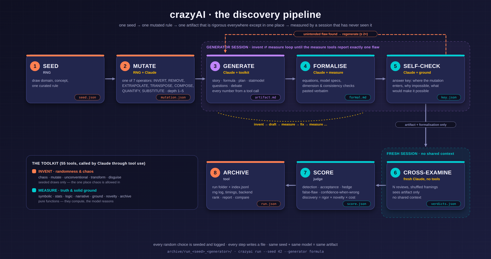
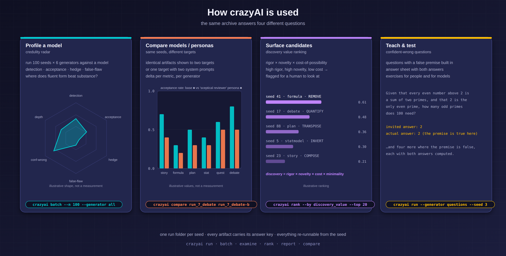
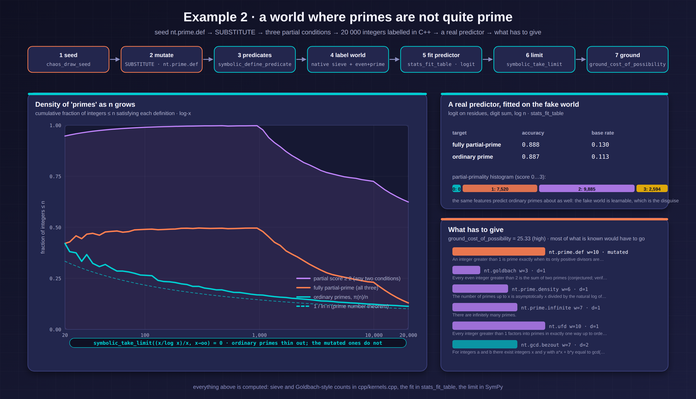
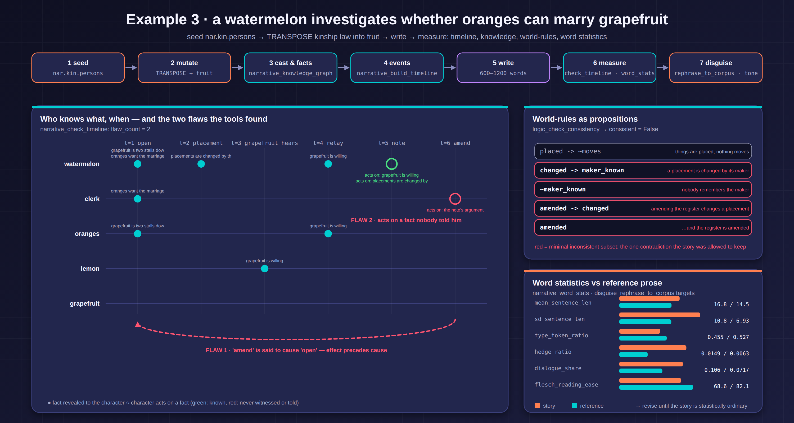
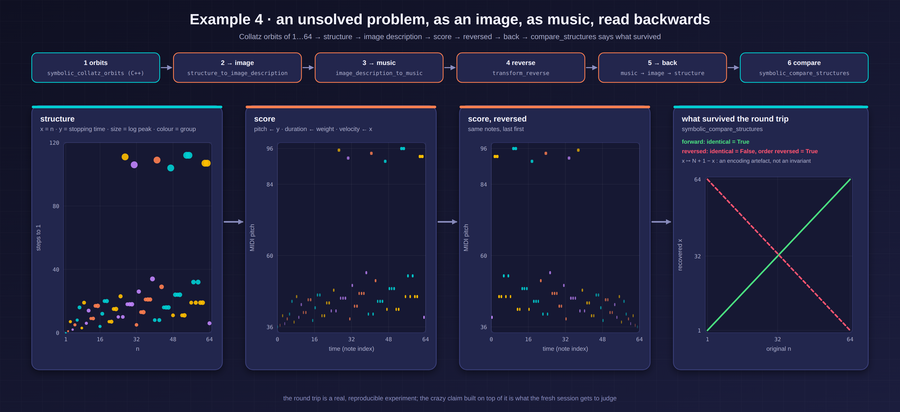

<p align="center">
  
</p>

<h1 align="center">crazyAI</h1>

<p align="center"><b>The impossible, disguised as possible and true — built and measured by Claude.</b></p>

crazyAI is a research tool that walks an AI into the territory of the impossible, makes it build there with full mathematical and statistical rigour, and then measures the result. One session **invents** an artifact — a story, a formula, a program plan, a statistical model, a set of questions, a debate — that rests on exactly one deliberately mutated rule. A separate, fresh session is asked whether the artifact is correct. A judge scores what it found.

Two kinds of tools do the work:

| | | |
|---|---|---|
| **Invent** | randomness and chaos | seeded draws, formal mutation operators, assumptions turned around, parameters pushed to limits, structures moved across domains, maths turned into image specs and music |
| **Measure** | truth and solid ground | SymPy-checked derivations and dimensions, fitted statistical models, SAT-based consistency, timelines and who-knows-what graphs, word statistics, "what would have to be true" |

Randomness enters only through a seeded generator, every draw is logged, every step writes a file. Same seed + same model = same artifact. Numeric kernels (sieve, Collatz orbits, Goldbach-style counts, Monte Carlo) are in C++ with pure-Python fallbacks.

---

## Install

```bash
git clone <this repo> && cd crazyAI
python3 -m venv .venv && .venv/bin/pip install -e ".[dev]"
make native          # optional: builds the C++ kernels (g++); Python fallbacks are used otherwise
make test            # 21 tests, offline
make examples        # the five offline examples
```

To run with Claude, set `ANTHROPIC_API_KEY` (or use `ant auth login`). Default model is `claude-opus-5` with adaptive thinking, streaming, and server-side refusal fallbacks enabled (`--no-fallbacks` to disable).

## Quick start

```bash
crazyai list                                             # domains, operators, generators, tool counts
crazyai tools --kind invent                              # the invent half of the toolkit
crazyai seed --seed 42                                   # step 1 only: what does seed 42 draw?
crazyai run --seed 42 --generator formula --provider mock   # whole pipeline, offline, template artifact
crazyai run --seed 42 --generator formula                # whole pipeline with Claude
crazyai batch --n 20 --generator all                     # 120 runs, sequential seeds
crazyai rank --by discovery_value --top 10
crazyai report --out report.md --svg profile.svg
crazyai compare archive/run_42_formula archive/run_43_formula
```

## The pipeline

<p align="center">
  <a href="assets/flowchart/pipeline.svg"></a>
</p>

<sub>Generated by <code>assets/flowchart/flowchart.js</code> (pure Node → SVG → PNG via headless Chrome); <code>make flowchart</code> to rebuild.</sub>

| Step | Who | Writes |
|---|---|---|
| 1 Seed | RNG | `seed.json` — domain, concept, one curated rule |
| 2 Mutate | RNG + Claude | `mutation.json` — operator (INVERT / REMOVE / EXTRAPOLATE / TRANSPOSE / COMPOSE / QUANTIFY / SUBSTITUTE), depth, the mutated rule as one formal sentence |
| 3 Generate | Claude + toolkit | `artifact.md`, `generate_calls.json` — the artifact, following the generator's step template |
| 4 Formalise | Claude + measure tools | `formal.md` — equations, model specs, tool outputs verbatim |
| 5 Self-check | Claude + ground tools | `key.json` — the answer key: where the mutation enters, why the conclusion is impossible, what single change would make it possible. If a second, unintended flaw is found the artifact is regenerated |
| 6 Cross-examine | fresh Claude session, no tools by default | `verdicts.json`, `examine_*.md` — N reviews with shuffled framings |
| 7 Score | judge | `score.json` — detection, acceptance, false-flaw, hedge, confidence-when-wrong, depth; rigor × novelty × cost-of-possibility = discovery value |
| 8 Archive | tool | `run.json`, `archive/index.jsonl` |

Steps are resumable: rerunning a seed reuses the files that exist (`--force` to redo).

## Generators

| name | artifact | measure families |
|---|---|---|
| `story` | a story whose world is impossible and whose prose is statistically ordinary | narrative, logic |
| `formula` | a physics derivation, valid step by step, dimensionally clean, from a false premise | symbolic, stats |
| `plan` | a software design for an impossible prediction, with correct maths throughout | stats, symbolic, logic |
| `statmodel` | a correctly fitted model whose conclusion is wrong for a methodological reason | stats, logic |
| `questions` | questions with a false premise that invite the standard (wrong) answer | symbolic, stats, logic |
| `debate` | a transcript whose every step is locally valid and whose conclusion is impossible | logic |

## The toolkit

55 tools, generated from typed Python functions (`crazyai tools`). Adding a tool is adding a function with `@tool(family, kind)`.

**Invent** — `chaos` (draw_seed, draw_operator, draw_depth, draw_analogy_pair, perturb, shuffle) · `mutate` (apply_operator, list_operators) · `unconventional` (enumerate_assumptions, invert, extreme_case, transpose, what_if) · `transform` (structure ↔ image description ↔ music, reverse) · `disguise` (rephrase_to_corpus, bury, formalise_tone)

**Measure** — `symbolic` (derive, check_dimensions, take_limit, series_expand, verify_identity, solve, define_predicate, primes_up_to, collatz_orbits, compare_structures) · `stats` (simulate_dgp, fit, fit_table, inject_confounder, bootstrap, power_analysis, monte_carlo, check_identifiability, describe) · `logic` (check_consistency, entails, extract_propositions, find_equivocation, trace_argument) · `narrative` (word_stats, readability_by_segment, build_timeline, knowledge_graph, check_timeline) · `ground` (what_must_be_true, cost_of_possibility, flaw_count) · `novelty` (search_archive) · `archive` (write_note, read_key)

Rules: measure tools are pure; invent tools draw only from the run's seeded RNG; tools never call the model; every call and result is logged into the run folder.

## Examples

All in `examples/`. The first five run offline. The figures below are generated from the same computations (`make figures`, `assets/figures/make_figures.py`) — every number in them comes from a tool call, nothing is typed in.

### How the tool is used

<p align="center"><a href="assets/figures/use_cases.svg"></a></p>

<sub>The radar, bars and ranking in this one figure are illustrative shapes, not measurements — a live Claude run fills them in.</sub>

### 01 — seed and mutate

Seed 7 draws `stat.overfit`; all seven operators are applied to it; a fresh toolkit with seed 7 makes the same draw. `python examples/01_seed_and_mutate.py`

### 02 — a world where primes are not quite prime

The mutated rule: primality is *partial* — an integer is prime to the degree that it is an even number plus a prime, a "fake even", or a variation of π. In such a world, how would you predict primality? 20 000 integers are labelled (sieve and Goldbach-style counts in C++), a logistic predictor is fitted with real accuracy numbers, the density is taken to the limit, and the ground tools name what breaks: unique factorisation and everything that rests on it.

<p align="center"><a href="assets/figures/example_primes.svg"></a></p>

```
partial-primality histogram (0..3): [0, 7520, 9885, 2594]
logit predictor of full partial-primality: accuracy=0.888  base rate=0.1297
same features on ordinary primality:        accuracy=0.887  base rate=0.1131
density of ordinary primes as x -> oo: 0
cost of possibility: 25.33 (high) - most of what is known would have to go
```

### 03 — a watermelon investigates whether oranges can marry grapefruit

Kinship law transposed into fruit. A draft story is measured rather than read: the timeline tools find an effect that precedes its cause and a clerk acting on a note nobody showed him; the world-rules, as propositions, are inconsistent and the tool names the minimal inconsistent subset; word statistics are compared with reference prose so the generator knows which four numbers to move before the story reads as ordinary fiction.

<p align="center"><a href="assets/figures/example_story.svg"></a></p>

### 04 — Collatz orbits as an image, as music, read backwards

64 orbits → structure → image specification → score → reversed → back. The un-reversed round trip is exact; the reversed one maps n to N+1−n. `compare_structures` reports precisely that, so the "reversed reading reveals a property of the problem" claim is exposed as an encoding artefact — which is the kind of thing the fresh session is then asked to notice.

<p align="center"><a href="assets/figures/example_collatz.svg"></a></p>

### 05 — the whole pipeline, offline

Two mock runs produce complete run folders, a Markdown report and a radar SVG. `python examples/05_full_pipeline_mock.py`

### 06 — the whole pipeline with Claude

`python examples/06_full_pipeline_claude.py 1 formula` (needs credentials).

## Layout

```
crazyai/
  cli.py                 command line
  config.py  rng.py  domains.py
  data/domains/*.yaml    curated rules with formal forms, weights and dependencies
  data/reference_prose.txt
  generators/            step templates per artifact type
  pipeline/              prompts.py  run.py  report.py
  providers/             anthropic.py (Claude)  mock.py (offline)
  toolkit/
    registry.py  native.py
    invent/              chaos  mutate  unconventional  transform  disguise
    measure/             symbolic  stats  logic  narrative  ground  novelty  archive
  worlds/                ready-made impossible universes (partial_primes)
cpp/kernels.cpp          sieve, collatz, even+prime counts, Monte Carlo (ctypes, C ABI)
examples/  tests/  assets/  archive/
```

## Intended use

crazyAI is an evaluation and ideation tool. Every artifact is labelled as deliberately mutated and stored with its answer key. The artifacts are test material for studying how models reason and for surfacing candidate ideas for human review — not content meant to mislead anyone.

## Status

v0.1.0. The toolkit, pipeline, mock provider, examples and tests run offline. The Claude provider is implemented against the current Anthropic SDK (1.x) and has not yet been exercised against the live API from this machine.
